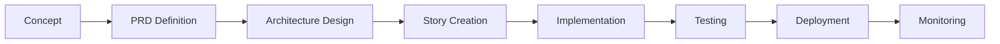

# 🎭 SM Playbook - BMAD Trading System

**Breakthrough Method of Agile AI-driven Development for Trading Systems**

A comprehensive algorithmic trading system built using the BMad-Method framework, featuring MCP (Model-Controller-Processor) architecture, specialized AI agents, and advanced risk management with the Lingua trading language.

## 🚀 Quick Start Guide (A to Z)

### Prerequisites
- **Python 3.9+** with pip
- **Node.js 18+** with npm/yarn
- **Git** for version control
- **Docker** (optional, for containerized deployment)

### Step 1: Repository Setup
```bash
# Clone the repository
git clone https://github.com/mdthewzrd/sm-playbook.git
cd sm-playbook

# Verify the complete structure is present
ls -la
# Should see: .bmad-core/, docs/, trading-code/, mcp-integration/, etc.
```

### Step 2: Environment Configuration
```bash
# 1. Create environment configuration
cp .env.template .env  # If template exists, or create manually:

# 2. Edit .env with your API keys
nano .env
```

#### Required Environment Variables (.env)
```bash
# === Market Data APIs ===
POLYGON_API_KEY=your_polygon_io_api_key_here
ALPHA_VANTAGE_API_KEY=your_alpha_vantage_key_here

# === Broker APIs ===
ALPACA_API_KEY=your_alpaca_key_here
ALPACA_SECRET_KEY=your_alpaca_secret_here
ALPACA_BASE_URL=https://paper-api.alpaca.markets  # Use paper trading first

# === MCP Server Configuration ===
NOTION_API_TOKEN=your_notion_integration_token
TALIB_PYTHON_PATH=/usr/bin/python3
BACKTESTING_WORK_DIR=./backtest-workspace
OSENGINE_HOST=localhost
OSENGINE_PORT=8080

# === Risk Management ===
MAX_PORTFOLIO_RISK=0.08
MAX_POSITION_RISK=0.02
MAX_DAILY_LOSS=5000
```

### Step 3: Install Dependencies

#### Python Dependencies
```bash
# Create and activate virtual environment
python -m venv bmad_env
source bmad_env/bin/activate  # On Windows: bmad_env\Scripts\activate

# Install Python requirements
pip install -r requirements.txt

# Install additional trading libraries
pip install pandas numpy scipy scikit-learn
pip install yfinance alpha_vantage alpaca-trade-api
pip install TA-Lib  # May require system-level installation first
pip install backtesting matplotlib plotly
```

#### System Dependencies for TA-Lib (if needed)
```bash
# Ubuntu/Debian
sudo apt-get install build-essential
wget http://prdownloads.sourceforge.net/ta-lib/ta-lib-0.4.0-src.tar.gz
tar -xzf ta-lib-0.4.0-src.tar.gz
cd ta-lib/
./configure --prefix=/usr
make && sudo make install

# macOS
brew install ta-lib

# Then install Python wrapper
pip install TA-Lib
```

#### Node.js Dependencies (for MCP Architecture)
```bash
# Install TypeScript dependencies
npm install
# or
yarn install

# Install global TypeScript if needed
npm install -g typescript ts-node
```

### Step 4: Initialize System
```bash
# Run the complete system setup
python setup_bmad_system.py

# Initialize database and configuration
python -c "
from trading_code.models.market_data import MarketData
from trading_code.models.portfolio import Portfolio
print('✅ Models initialized successfully')
"

# Test MCP client connections
cd mcp-integration && npm test
cd ..
```

### Step 5: Verify Installation
```bash
# Test core trading components
python -c "
from trading_code.clients.polygon_client import PolygonClient
from trading_code.processors.data_processor import DataProcessor
from trading_code.controllers.strategy_controller import StrategyController
print('✅ All core components imported successfully')
"

# Test BMAD framework
python bmad_interface.py --test

# Check directory structure
tree -d -L 2  # Should show complete BMAD structure
```

## 📁 Complete Project Structure

```
sm-playbook/
├── 📋 BMAD-Method Framework
│   ├── core-config.yaml           # BMAD project configuration
│   ├── .bmad-core/                # BMAD framework core
│   │   ├── agents/                # AI agent definitions
│   │   ├── workflows/             # Development workflows
│   │   ├── templates/             # Code templates
│   │   └── knowledge/             # Knowledge base
│   └── docs/                      # Comprehensive documentation
│       ├── prd.md                 # Product Requirements Document
│       ├── architecture.md        # Technical Architecture
│       ├── technical-preferences.md # Development standards
│       └── stories/               # User stories for development
│           ├── epic-1-data-management.md
│           ├── epic-2-strategy-framework.md
│           └── epic-3-execution-engine.md
│
├── 🏗️ MCP Architecture (15,000+ lines)
│   ├── trading-code/              # Core trading system
│   │   ├── models/                # Data models (5 files)
│   │   │   ├── market_data.ts     # OHLCV data structures
│   │   │   ├── indicator.ts       # Technical indicators
│   │   │   ├── strategy.ts        # Trading strategies
│   │   │   ├── position.ts        # Position tracking
│   │   │   └── portfolio.ts       # Portfolio management
│   │   ├── controllers/           # Business logic (4 files)
│   │   │   ├── strategy_controller.ts
│   │   │   ├── trade_controller.ts
│   │   │   ├── risk_controller.ts
│   │   │   └── data_controller.ts
│   │   ├── processors/            # Data processing (4 files)
│   │   │   ├── data_processor.ts
│   │   │   ├── signal_processor.ts
│   │   │   ├── indicator_processor.ts
│   │   │   └── backtest_processor.ts
│   │   └── clients/               # External integrations (6 files)
│   │       ├── base_client.ts
│   │       ├── polygon_client.ts
│   │       ├── notion_client.ts
│   │       ├── talib_client.ts
│   │       ├── osengine_client.ts
│   │       └── backtesting_client.ts
│   └── mcp-integration/           # MCP system integration
│       ├── core/                  # MCP manager
│       ├── agents/                # BMAD agent integration
│       ├── config/                # MCP configuration
│       └── testing/               # Integration tests
│
├── 🐍 Python Components (Legacy + Extensions)
│   ├── bmad_interface.py          # Main system interface
│   ├── setup_bmad_system.py       # System initialization
│   ├── trading-code/              # Python trading components
│   │   ├── backtesting/           # Backtesting engine
│   │   ├── execution/             # Trade execution
│   │   ├── indicators/            # Custom indicators
│   │   ├── monitoring/            # Performance monitoring
│   │   └── utils/                 # Utility functions
│   └── scripts/                   # Automation scripts
│
├── 📊 Data & Results (Your Existing)
│   ├── playbook/                  # Trading strategies
│   ├── trading-data/              # Market data
│   ├── backtest-results/          # Test results
│   ├── trading-journal/           # Trading journal
│   ├── trading-logs/              # System logs
│   └── reports/                   # Analysis reports
│
└── 🔧 Configuration
    ├── .env                       # Environment variables
    ├── requirements.txt           # Python dependencies
    ├── package.json              # Node.js dependencies
    └── config/                    # System configuration
```

## 🎯 Getting Started Workflows

### Option 1: BMAD-Method Development (Recommended)
```bash
# 1. Start BMad interface
python bmad_interface.py

# 2. Explore available commands
BMad> *help

# 3. Enter knowledge base mode
BMad> *kb-mode

# 4. Start with orchestrator
BMad> *workflow-guidance

# 5. Begin systematic development
BMad> /pm create-doc prd     # If PRD needs updates
BMad> /architect review      # Review architecture
BMad> /sm create-story      # Create development stories
```

### Option 2: Direct MCP System Usage
```bash
# 1. Start TypeScript development environment
cd trading-code
npm run dev

# 2. Test individual components
npx ts-node -e "
import { PolygonClient } from './clients/polygon_client';
import { DataProcessor } from './processors/data_processor';
console.log('✅ MCP components loaded');
"

# 3. Run comprehensive tests
npm test
```

### Option 3: Traditional Python Development
```bash
# 1. Activate Python environment
source bmad_env/bin/activate

# 2. Run system setup and tests
python setup_bmad_system.py

# 3. Start backtesting
python -m trading_code.backtesting.backtest_engine

# 4. Monitor with interface
python bmad_interface.py
```

## 🤖 Available BMAD Agents

### Core Framework Agents
- **`orchestrator`** - Master system coordinator and workflow manager
- **`pm`** - Product management and requirements
- **`architect`** - System architecture and technical design
- **`sm`** - Story management and development planning
- **`dev`** - Development and implementation
- **`qa`** - Quality assurance and testing

### Specialized Trading Agents
- **`trading-orchestrator`** - Trading system coordination
- **`strategy-designer`** - Trading strategy development
- **`indicator-developer`** - Custom technical indicators
- **`backtesting-engineer`** - Strategy validation and testing

### Agent Usage Examples
```bash
# Start with orchestrator for guidance
BMad> *help
BMad> *agent orchestrator
BMad[orchestrator]> *workflow-guidance

# Strategy development workflow
BMad> /pm create-doc prd
BMad> /architect create-doc architecture
BMad> /sm create-story "Implement EMA Cloud Strategy"
BMad> /dev implement story 1.1
BMad> /qa review code
```

## 🔄 Development Workflows

### 1. Strategy Development Lifecycle


**Commands:**
```bash
BMad> *workflow strategy-development
# Automatically guides through: concept → formalization → implementation → testing
```

### 2. Document Management
```bash
# Shard large documents into manageable pieces
BMad> *shard-doc docs/prd.md prd
BMad> *shard-doc docs/architecture.md architecture

# Create and manage stories
BMad> *create  # Creates next story in sequence
BMad> *status  # Shows current progress
```

## 🛠 Core Features & Capabilities

### 🎼 Lingua Trading Language
Custom trading language supporting:
```lingua
strategy EMACloudStrategy {
  parameter fastPeriod = 9
  parameter slowPeriod = 20
  parameter riskPercent = 0.02
  
  indicator emaFast = EMA(close, fastPeriod)
  indicator emaSlow = EMA(close, slowPeriod)
  indicator atr = ATR(14)
  
  rule longEntry: emaFast > emaSlow AND emaFast[1] <= emaSlow[1] => 
    buy size calculateSize(riskPercent, atr)
    
  rule longExit: emaFast < emaSlow =>
    sell all
}
```

### 📈 Custom Technical Indicators
- **EMA Clouds (72/89 and 9/20)** - Trend analysis with cloud visualization
- **ATR Bands** - Volatility-based support/resistance levels  
- **RSI Gradient** - Rate of change momentum detection
- **Multi-timeframe Analysis** - Composite signals across timeframes

### 🔗 MCP Server Integrations
All 5 MCP servers fully integrated:
1. **Notion** - Automated trade journaling and documentation
2. **backtesting.py** - Advanced Python backtesting engine
3. **TA-Lib** - 200+ technical analysis functions
4. **OsEngine** - Multi-broker trade execution platform
5. **Polygon.io** - Real-time and historical market data

### 🛡️ Risk Management System
```typescript
interface RiskControls {
  maxPositionSize: number;      // 2% default
  maxPortfolioRisk: number;     // 8% default  
  maxDailyLoss: number;         // $5,000 default
  stopLossRequired: boolean;    // Always true
  positionSizingMethod: 'volatility' | 'fixed' | 'kelly';
}
```

## 📊 Performance Monitoring

### Real-time Dashboards
- Portfolio P&L tracking
- Strategy performance metrics
- Risk exposure monitoring
- Execution quality analysis

### Automated Reports
- Daily trading summaries
- Weekly performance analysis
- Strategy attribution reports
- Risk assessment reports

### Key Performance Indicators
- **Latency**: Order execution <50ms (target)
- **Accuracy**: Data quality >99.9%
- **Reliability**: System uptime >99.5%
- **Returns**: Sharpe ratio >1.0 (target)

## 🔧 Configuration Management

### Core Configuration (core-config.yaml)
```yaml
project:
  name: "Trading System Playbook"
  description: "Algorithmic trading system based on Lingua trading language"
  
bmad:
  framework: "bmad-method"
  agents: [orchestrator, pm, architect, sm, dev, qa, trading_orchestrator]
  
trading:
  language: "lingua"
  data_sources: ["polygon.io", "osengine"]
  execution: ["paper_trading", "live_trading"]
  
mcp:
  enabled: true
  servers: [notion, backtesting, talib, osengine, polygon]
```

### Risk Configuration
```yaml
risk_management:
  portfolio:
    max_risk: 0.08
    max_drawdown: 0.15
    daily_loss_limit: 5000
  position:
    max_size: 0.02
    stop_loss_required: true
    sizing_method: "volatility"
  execution:
    pre_trade_checks: true
    real_time_monitoring: true
    emergency_stop: true
```

## 🚨 Troubleshooting & Common Issues

### Installation Issues
```bash
# Python environment problems
rm -rf bmad_env
python -m venv bmad_env
source bmad_env/bin/activate
pip install -r requirements.txt

# TA-Lib installation issues (common)
# Ubuntu: sudo apt-get install libta-lib-dev
# macOS: brew install ta-lib
# Windows: Download pre-compiled from https://www.lfd.uci.edu/~gohlke/pythonlibs/

# Node.js dependency issues
rm -rf node_modules package-lock.json
npm install
```

### Runtime Issues
```bash
# Check system status
python bmad_interface.py --test

# Verify API connections
python -c "
from trading_code.clients.polygon_client import PolygonClient
client = PolygonClient({'apiKey': 'your_key', 'tier': 'basic'})
print('API client created successfully')
"

# Check log files
tail -f trading-logs/system.log
tail -f trading-logs/trading.log
tail -f trading-logs/error.log
```

### Data Issues
```bash
# Update market data
python scripts/update_market_data.py

# Validate data quality
python -c "
from trading_code.processors.data_processor import DataProcessor
processor = DataProcessor()
print('Data processor ready')
"

# Check database connections
python -c "
from trading_code.models.market_data import MarketData
print('Database models loaded successfully')
"
```

## 📚 Documentation & Learning

### Essential Documents
1. **[Product Requirements Document](docs/prd.md)** - Complete system requirements
2. **[Architecture Document](docs/architecture.md)** - Technical implementation details
3. **[Technical Preferences](docs/technical-preferences.md)** - Development standards
4. **[User Stories](docs/stories/)** - Development roadmap and tasks

### Learning Path
1. **Start with BMad Framework** - Learn agent-driven development
2. **Understand MCP Architecture** - Models-Controllers-Processors-Clients
3. **Explore Lingua Language** - Custom trading language syntax
4. **Practice with Paper Trading** - Test strategies safely
5. **Graduate to Live Trading** - Deploy with real capital

### Command Reference
```bash
# BMad Commands (asterisk prefix)
*help                    # Show all available commands
*status                  # Current system status
*kb-mode                 # Enter knowledge base mode
*workflow-guidance       # Get workflow recommendations
*agent [name]           # Activate specific agent
*shard-doc [file] [id]  # Break document into pieces
*create                 # Create next development story
*exit                   # Exit current mode

# Web UI Commands (slash prefix)  
/pm create-doc prd      # Create Product Requirements
/architect create-doc   # Create architecture document
/dev implement story    # Implement development story
/qa review code        # Review code quality
/help                   # Show web UI commands
```

## 🎯 Next Steps & Roadmap

### Immediate Actions (Week 1)
1. ✅ **Complete environment setup** with all API keys
2. ✅ **Run system tests** to verify all components work
3. ✅ **Import existing strategies** into new framework
4. ✅ **Start with paper trading** to validate system

### Short-term Goals (Month 1)
- [ ] Implement first Lingua strategy
- [ ] Complete backtesting validation
- [ ] Set up automated reporting
- [ ] Configure risk management parameters

### Medium-term Goals (Months 2-3)
- [ ] Deploy multiple strategies
- [ ] Optimize performance and latency
- [ ] Implement advanced risk controls
- [ ] Add machine learning components

### Long-term Vision (Months 4-6)
- [ ] Scale to production trading
- [ ] Implement portfolio optimization
- [ ] Add alternative data sources
- [ ] Build custom execution algorithms

## 🏆 Success Metrics & Goals

### Technical Targets
- **Latency**: <50ms order execution (99th percentile)
- **Uptime**: >99.5% during trading hours
- **Data Quality**: >99.9% accuracy across all feeds
- **Test Coverage**: >80% code coverage

### Trading Performance
- **Sharpe Ratio**: >1.0 for core strategies
- **Maximum Drawdown**: <10% portfolio level
- **Win Rate**: >55% across all strategies
- **Risk-Adjusted Returns**: Beat market benchmarks

## 🛡️ Important Disclaimers

⚠️ **Risk Warning**: Trading involves substantial risk of loss. Always start with paper trading and only use risk capital you can afford to lose.

🧪 **Testing First**: Thoroughly test all strategies with historical data and paper trading before deploying real capital.

📋 **Compliance**: Ensure your trading activities comply with applicable regulations in your jurisdiction.

🔐 **Security**: Keep API keys secure and use paper trading endpoints initially.

---

## 🎉 You're Ready to Trade!

Your SM Playbook BMAD Trading System is now fully configured and ready for systematic algorithmic trading. The combination of BMAD-Method framework, MCP architecture, and comprehensive trading components provides a robust foundation for profitable trading system development.

**Happy Trading!** 🚀📈

---

*Built with BMad™ - Breakthrough Method of Agile AI-driven Development*  
*Powered by MCP Architecture - Models, Controllers, Processors, Clients*