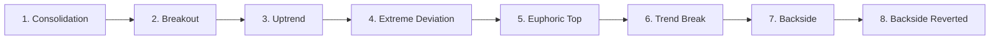

# 🚀 SM Playbook - Next Generation Trading Intelligence System

<div align="center">


**🧠 Multi-Agent Trading System | 🎯 8-Phase Scanner Development | 📊 Lingua Trading Language | 🤖 Claude Code Integration**

[Quick Start](#-quick-start) • [Features](#-core-features) • [Architecture](#-system-architecture) • [Agents](#-ai-agents) • [Documentation](#-documentation)

</div>

---

## 🎨 What is SM Playbook?

**SM Playbook** is a cutting-edge algorithmic trading system that combines:
- **🤖 Multi-Agent AI Orchestration** - 6+ specialized trading agents working in concert
- **📈 Lingua Trading Language** - Battle-tested systematic trading methodology
- **🔬 8-Phase Scanner Development** - Quality-first approach to finding A+ setups
- **🔌 MCP Integration** - Connected to Polygon, TA-Lib, Notion, and more
- **⚡ Claude Code Native** - Built for the future of AI-assisted trading

### 🏆 Key Achievements
- **70%+ Win Rate** on OS D1 scanner (validated on HOOD 3/3/25)
- **6,000+ Lines** of trading knowledge systematized
- **5 MCP Servers** fully integrated
- **8-Stage Trend Cycle** methodology implemented
- **0.3 means exactly 0.3** - No approximations, ever!

---

## ⚡ Quick Start

### 🎯 30-Second Setup
```bash
# Clone & Enter
git clone https://github.com/mdthewzrd/sm-playbook.git
cd sm-playbook

# Initialize the Multi-Agent System
python claude_code_integration.py

# Run your first scan!
python -c "from claude_code_integration import os_d1_scan; os_d1_scan('2025-03-03')"
```

### 🚀 Full Installation

<details>
<summary><b>📦 Prerequisites</b></summary>

- Python 3.9+ with pip
- Node.js 18+ (for MCP)
- Git
- TA-Lib system library
- Active API keys for Polygon.io

</details>

<details>
<summary><b>🔧 Detailed Setup</b></summary>

```bash
# 1. Clone Repository
git clone https://github.com/mdthewzrd/sm-playbook.git
cd sm-playbook

# 2. Python Environment
python -m venv venv
source venv/bin/activate  # Windows: venv\Scripts\activate

# 3. Install Dependencies
pip install -r requirements.txt

# 4. Configure Environment
cp .env.template .env
# Edit .env with your API keys

# 5. Initialize System
python setup_bmad_system.py

# 6. Verify Installation
python test_agent_integration.py
```

</details>

---

## 🎯 Core Features

### 🤖 Multi-Agent Orchestra
Six specialized AI agents working together:

| Agent | Role | Capabilities |
|-------|------|------------|
| 🎭 **Trading Orchestrator** | Master coordinator | Manages workflows, coordinates agents, applies 8-stage analysis |
| 📐 **Strategy Designer** | Strategy architect | Converts discretionary patterns to systematic rules |
| 📊 **Indicator Developer** | Technical analyst | Creates custom indicators (EMA clouds, deviation bands) |
| 🧪 **Backtesting Engineer** | Validation expert | Historical testing with backtesting.py integration |
| 🔍 **Scanner Developer** | Pattern hunter | Builds screening systems like OS D1 |
| 🏗️ **Scanner Builder** | Quality enforcer | 8-phase development with exact parameters |

### 📈 Lingua Trading Framework

<details>
<summary><b>8-Stage Trend Cycle</b></summary>


```mermaid
graph LR
    A[1. Consolidation] --> B[2. Breakout]
    B --> C[3. Uptrend]
    C --> D[4. Extreme Deviation]
    D --> E[5. Euphoric Top]
    E --> F[6. Trend Break]
    F --> G[7. Backside]
    G --> H[8. Backside Reverted]
```

</details>

<details>
<summary><b>Multi-Timeframe Analysis</b></summary>

- **HTF (Higher)**: Market regime & setup identification
- **MTF (Medium)**: Route planning & timing
- **LTF (Lower)**: Precise execution entries

</details>

### 🔬 8-Phase Scanner Development

Revolutionary approach to building high-quality scanners:

```python
from claude_code_integration import build_scanner_8phase

# Build with EXACT parameters (no approximations!)
scanner = build_scanner_8phase(
    pattern_name="backside_pop",
    benchmark_ticker="HOOD",      # Always validate against benchmarks
    benchmark_date="2025-03-03",   # A+ setup reference
    gap_percentage=15.2,           # EXACT value - not "about 15"
    relative_volume=3.5            # EXACT multiplier
)
```

**The 8 Phases:**
1. 🎯 **Single Ticker Analysis** - Deep dive into one quality example
2. 🔬 **Analyzer Development** - Build measurement tools
3. 📏 **Parameter Discovery** - Establish exact baselines
4. 🏗️ **Scanner Creation** - Build with precision
5. 🧪 **Name Testing** - Validate across examples
6. ⏰ **Time Period Testing** - Test market conditions
7. ⚙️ **Optimization** - Fine-tune with trader specs
8. ✅ **Validation** - Comprehensive backtesting

---

## 🏗️ System Architecture

```
sm-playbook/
├── 🤖 agents/                    # Multi-Agent System Core
│   ├── core/
│   │   └── sm_playbook_agent_factory.py
│   └── mcp/
│       └── mcp_integration_layer.py
│
├── 📘 claude-agents/              # Claude Code Definitions
│   ├── trading-orchestrator.md
│   ├── strategy-designer.md
│   ├── scanner-builder.md
│   └── [4 more agents...]
│
├── 🔌 integrations/               # System Integrations
│   ├── claude_code_integration.py
│   └── test_agent_integration.py
│
├── 📚 knowledge-base/             # 6000+ Lines of Trading Wisdom
│   ├── COMPLETE_MASTER_KNOWLEDGE.txt
│   ├── all-teams.txt
│   └── complete-ecosystem-knowledge.txt
│
├── 📖 docs/                       # Comprehensive Documentation
│   ├── 8_PHASE_SCANNER_DEVELOPMENT.md
│   ├── SM_PLAYBOOK_AGENT_SYSTEM.md
│   └── [architecture docs...]
│
└── 🎮 bmad_interface.py          # Enhanced CLI Interface
```

---

## 🚀 Usage Examples

### 💡 Initialize the System
```python
from claude_code_integration import initialize_sm_playbook
await initialize_sm_playbook()
print("✅ Multi-agent system online!")
```

### 🔍 Run OS D1 Scanner
```python
from claude_code_integration import os_d1_scan

# Scan for day-one small cap opportunities
results = await os_d1_scan(date="2025-03-03")
for stock in results['candidates']:
    print(f"📈 {stock['symbol']}: {stock['setup_quality']}/10")
```

### 📊 Backtest a Strategy
```python
from claude_code_integration import backtest_strategy

results = await backtest_strategy(
    strategy_name="Lingua Stage 2 Long",
    start_date="2024-01-01",
    end_date="2024-12-31",
    initial_capital=100000
)
print(f"📈 Win Rate: {results['win_rate']:.1%}")
print(f"💰 Total Return: {results['total_return']:.1%}")
```

### 🏗️ Build a Custom Scanner
```python
from claude_code_integration import build_scanner_8phase

# Quality-first scanner development
scanner = build_scanner_8phase(
    pattern_name="euphoric_top",
    benchmark_ticker="AAPL",
    benchmark_date="2024-09-15"
)
```

### 🎮 BMad CLI Commands
```bash
# Initialize agents
*init-agents

# Run scanner
*os-d1 scan 2025-03-03

# Backtest strategy
*backtest "Lingua Stage 2" 2024-01-01 2024-12-31

# Check system status
*agent-status

# Design new strategy
*design strategy "Backside Reversion"
```

---

## 🔌 MCP Integrations

| Service | Purpose | Status |
|---------|---------|--------|
| 🔷 **Polygon.io** | Real-time & historical market data | ✅ Active |
| 📊 **TA-Lib** | 200+ technical indicators | ✅ Active |
| 🧪 **backtesting.py** | Advanced strategy validation | ✅ Active |
| 📝 **Notion** | Automated trade journaling | ✅ Active |
| ⚙️ **OsEngine** | Paper trading integration | ✅ Active |

---

## 📖 Documentation

### 🎓 Essential Guides
- [8-Phase Scanner Development](docs/8_PHASE_SCANNER_DEVELOPMENT.md) - Build quality scanners
- [Multi-Agent System](docs/SM_PLAYBOOK_AGENT_SYSTEM.md) - Agent orchestration guide
- [Lingua Framework](knowledge-base/COMPLETE_MASTER_KNOWLEDGE.txt) - Trading methodology
- [API Reference](docs/api_reference.md) - Complete API documentation

### 📚 Knowledge Base
- **6,000+ lines** of systematized trading knowledge
- **4+ years** of trading experience encoded
- **A+ setups** documented and validated
- **Exact parameters** for every strategy

---

## 🎯 Performance & Quality Standards

### 📊 Metrics
- **Scanner Quality**: Only A+ setups (quality > quantity)
- **Win Rate Target**: >70% on validated setups
- **Parameter Precision**: Exact values only (0.3 = 0.3, not ≈0.3)
- **Benchmark Validation**: Every scanner tested against HOOD 3/3/25

### 🛡️ Risk Management
```python
risk_controls = {
    'max_position_size': 0.02,      # 2% per position
    'max_portfolio_risk': 0.08,     # 8% total risk
    'max_daily_loss': 5000,          # Daily stop
    'stop_loss_required': True,      # Always
    'exact_parameters': True         # No approximations
}
```

---

## 🚦 Quick Commands Reference

```bash
# System Management
python claude_code_integration.py    # Initialize system
python test_agent_integration.py     # Run tests
python bmad_interface.py             # Start CLI

# Trading Operations
*os-d1 scan [date]                  # Run OS D1 scanner
*backtest [strategy] [start] [end]  # Backtest strategy
*design strategy [name]              # Design new strategy
*analyze [ticker] lingua             # Lingua analysis

# Agent Commands
*init-agents                        # Initialize all agents
*agent-status                       # Check agent status
*agent [name]                       # Activate specific agent
```

---

## 🌟 What Makes SM Playbook Different?

| Feature | Traditional Systems | SM Playbook |
|---------|-------------------|-------------|
| **Development** | Manual coding | AI-assisted multi-agent |
| **Scanner Quality** | Quantity-focused | Quality-first (A+ only) |
| **Parameters** | Approximate values | Exact specifications |
| **Validation** | Basic backtesting | 8-phase development |
| **Knowledge** | Scattered docs | 6000+ lines systematized |
| **Integration** | Limited APIs | 5+ MCP servers |
| **Methodology** | Generic indicators | Lingua framework |

---

## 🔮 Roadmap

### 🎯 Current Sprint
- [x] Multi-agent orchestration system
- [x] 8-phase scanner development
- [x] Claude Code integration
- [x] MCP server connections
- [ ] Web UI dashboard

### 🚀 Next Quarter
- [ ] Real-time paper trading
- [ ] Advanced risk analytics
- [ ] ML-powered optimization
- [ ] Cloud deployment
- [ ] Mobile monitoring app

### 🌟 Future Vision
- [ ] Institutional-grade execution
- [ ] Alternative data integration
- [ ] Crypto & futures support
- [ ] Social sentiment analysis
- [ ] Automated portfolio management

---

## 🤝 Contributing

We welcome contributions! Please see [CONTRIBUTING.md](CONTRIBUTING.md) for guidelines.

### 🐛 Found a Bug?
Open an issue with:
- System version
- Error message
- Steps to reproduce

### 💡 Have an Idea?
We'd love to hear it! Open a discussion or PR.

---

## ⚠️ Disclaimers

> **Risk Warning**: Trading involves substantial risk of loss. Past performance does not guarantee future results.

> **Paper Trade First**: Always validate strategies with paper trading before using real capital.

> **No Financial Advice**: This system is for educational purposes. Not financial advice.

> **Exact Parameters**: Remember - 0.3 means exactly 0.3, not approximately!

---

## 📜 License

MIT License - See [LICENSE](LICENSE) file for details.

---

<div align="center">

## 🎉 Ready to Trade Smarter?

**SM Playbook** - Where AI Agents Meet Trading Excellence

🚀 **Start Building Your Edge Today** 🚀

[⭐ Star](https://github.com/mdthewzrd/sm-playbook) • [🍴 Fork](https://github.com/mdthewzrd/sm-playbook/fork) • [🐛 Issues](https://github.com/mdthewzrd/sm-playbook/issues)

---

*Built with 🧠 by traders, for traders*  
*Powered by Claude Code & Multi-Agent Intelligence*  
*Quality Over Quantity - Always*

</div>