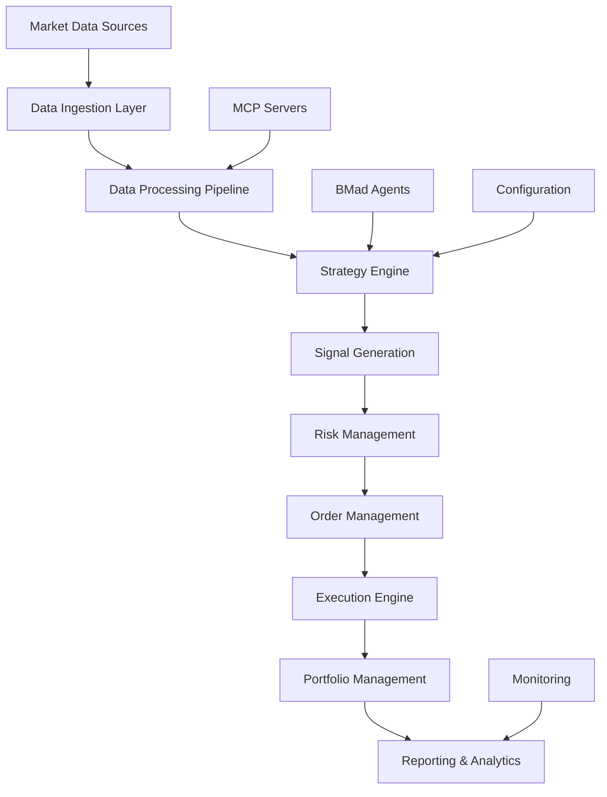
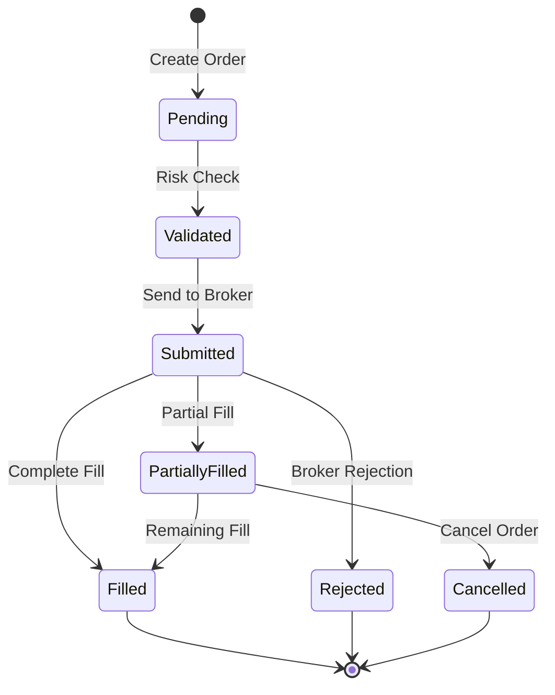
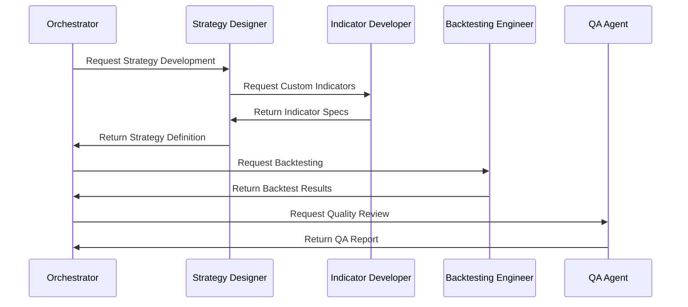

# Trading System Architecture Document

## 1. Executive Summary

This document outlines the technical architecture for the Trading System Playbook, a comprehensive algorithmic trading system built using the BMad-Method framework and Model-Controller-Processor (MCP) architecture pattern.

### 1.1 Architecture Overview
The system employs a modular, event-driven architecture with clear separation of concerns across data ingestion, strategy execution, risk management, and trade execution layers. The MCP pattern ensures scalability, maintainability, and testability.

### 1.2 Key Design Principles
- **Modularity**: Clear separation between components
- **Scalability**: Horizontal scaling capabilities
- **Reliability**: Fault tolerance and graceful degradation
- **Performance**: Low-latency execution and high throughput
- **Security**: End-to-end encryption and access controls
- **Observability**: Comprehensive monitoring and logging

## 2. System Architecture Overview

### 2.1 High-Level Architecture

```
┌─────────────────────────────────────────────────────────────────┐
│                     BMad-Method Framework                       │
├─────────────────────────────────────────────────────────────────┤
│  Orchestrator │ PM Agent │ Architect │ SM │ Dev │ QA │ Trading  │
│     Agent     │          │   Agent   │    │     │    │ Agents   │
└─────────────────────────────────────────────────────────────────┘
                                    │
┌─────────────────────────────────────────────────────────────────┐
│                    MCP Architecture Layer                       │
├─────────────────┬─────────────────┬─────────────────┬───────────┤
│     Models      │   Controllers   │   Processors    │  Clients  │
│                 │                 │                 │           │
│ • Market Data   │ • Strategy      │ • Data Proc     │ • Notion  │
│ • Indicators    │ • Trade         │ • Signal Proc   │ • Backtest│
│ • Strategies    │ • Risk          │ • Indicator     │ • TA-Lib  │
│ • Positions     │ • Data          │ • Backtest      │ • OsEngine│
│ • Portfolio     │                 │                 │ • Polygon │
└─────────────────┴─────────────────┴─────────────────┴───────────┘
                                    │
┌─────────────────────────────────────────────────────────────────┐
│                    Integration Layer                            │
├─────────────────┬─────────────────┬─────────────────┬───────────┤
│   Data Layer    │  Strategy Layer │ Execution Layer │Monitoring │
│                 │                 │                 │   Layer   │
│ • Data Sources  │ • Lingua Lang   │ • Order Mgmt    │ • Metrics │
│ • Data Pipeline │ • Strategy Eng  │ • Risk Engine   │ • Alerts  │
│ • Data Storage  │ • Backtesting   │ • Position Mgmt │ • Logging │
│ • Data Quality  │ • Optimization  │ • Trade Reports │ • Health  │
└─────────────────┴─────────────────┴─────────────────┴───────────┘
```

### 2.2 Component Interaction Flow



## 3. Detailed Component Architecture

### 3.1 Models Layer

#### 3.1.1 Market Data Model
```typescript
class MarketData {
  - symbol: string
  - timeframe: Timeframe
  - data: CandleData[]
  - quality: DataQuality
  + validate(): boolean
  + transform(): MarketData
  + getTimeframeData(): CandleData[]
}
```

**Responsibilities**:
- OHLCV data structure and validation
- Multi-timeframe data management
- Data quality assessment
- Data transformation utilities

**Key Features**:
- Support for 5m, 15m, 1h, 1d timeframes
- Data quality scoring and validation
- Memory-efficient data storage
- Thread-safe data access

#### 3.1.2 Indicator Model
```typescript
class IndicatorCalculator {
  + calculateEMACloud(): IndicatorValue[]
  + calculateATRBands(): IndicatorValue[]
  + calculateRSIGradient(): IndicatorValue[]
  + calculateCustom(): IndicatorValue[]
}
```

**Responsibilities**:
- Technical indicator calculations
- Custom indicator framework
- Multi-timeframe indicator support
- Indicator caching and optimization

**Key Features**:
- 200+ standard indicators via TA-Lib integration
- Custom Lingua indicators (EMA clouds, ATR bands, RSI gradient)
- Efficient calculation algorithms
- Result caching for performance

### 3.2 Controllers Layer

#### 3.2.1 Strategy Controller
```typescript
class StrategyController {
  + executeStrategy(): Promise<TradingSignal[]>
  + runBacktest(): Promise<BacktestResult>
  + optimizeParameters(): Promise<OptimizationResult>
  + validateStrategy(): Promise<ValidationResult>
}
```

**Responsibilities**:
- Strategy lifecycle management
- Signal generation orchestration
- Backtesting coordination
- Strategy validation and testing

**Key Features**:
- Event-driven strategy execution
- Multi-strategy portfolio support
- Real-time and historical testing
- Performance monitoring integration

#### 3.2.2 Risk Controller
```typescript
class RiskController {
  + assessPortfolioRisk(): RiskAssessment
  + calculatePositionSize(): number
  + monitorExposure(): ExposureMetrics
  + enforceRiskLimits(): boolean
}
```

**Responsibilities**:
- Real-time risk monitoring
- Position sizing calculations
- Exposure management
- Risk limit enforcement

**Key Features**:
- Value-at-Risk calculations
- Dynamic position sizing
- Correlation analysis
- Emergency stop mechanisms

### 3.3 Processors Layer

#### 3.3.1 Data Processor
```typescript
class DataProcessor {
  + processMarketData(): Promise<DataTransformResult>
  + validateDataQuality(): DataQuality
  + fillDataGaps(): CandleData[]
  + removeOutliers(): CandleData[]
}
```

**Responsibilities**:
- Raw data transformation
- Data quality validation
- Gap filling and cleaning
- Outlier detection and removal

**Key Features**:
- Real-time data processing
- Configurable quality thresholds
- Multiple cleaning algorithms
- Performance monitoring

#### 3.3.2 Signal Processor
```typescript
class SignalProcessor {
  + processSignals(): Promise<ProcessedSignal[]>
  + generateSignal(): ProcessedSignal
  + validateSignal(): boolean
  + filterSignals(): ProcessedSignal[]
}
```

**Responsibilities**:
- Multi-component signal generation
- Signal confidence scoring
- Signal filtering and validation
- Signal aggregation and weighting

**Key Features**:
- Component-based signal architecture
- Machine learning signal enhancement
- Signal quality metrics
- Real-time signal processing

### 3.4 Clients Layer

#### 3.4.1 Base Client Architecture
```typescript
abstract class BaseClient {
  # config: ClientConfig
  # connected: boolean
  + abstract connect(): Promise<void>
  + abstract disconnect(): Promise<void>
  + request<T>(): Promise<ClientResponse<T>>
}
```

**Common Features**:
- Connection management and pooling
- Rate limiting and throttling
- Retry logic and error handling
- Health monitoring and metrics

#### 3.4.2 Specialized Clients
- **Polygon Client**: Real-time and historical market data
- **OsEngine Client**: Trade execution and broker integration
- **TA-Lib Client**: Technical indicator calculations
- **Backtesting Client**: Strategy backtesting and optimization
- **Notion Client**: Documentation and trade journaling

## 4. Data Architecture

### 4.1 Data Pipeline

```
Raw Data → Ingestion → Validation → Transformation → Storage → Access
    ↓         ↓           ↓             ↓            ↓        ↓
Polygon.io  WebSocket   Quality      Normalization  Cache   API
OsEngine    REST API    Checks       Aggregation   Database Strategy
                                     Enrichment             Engine
```

### 4.2 Data Storage Strategy

#### 4.2.1 Time-Series Database
- **Primary**: InfluxDB for high-frequency trading data
- **Secondary**: PostgreSQL for metadata and configuration
- **Cache**: Redis for real-time data and session management
- **Archive**: S3/MinIO for long-term historical data storage

#### 4.2.2 Data Partitioning
```sql
-- Example partitioning strategy
PARTITION BY RANGE (timestamp) (
    PARTITION p_2024_01 VALUES LESS THAN ('2024-02-01'),
    PARTITION p_2024_02 VALUES LESS THAN ('2024-03-01'),
    ...
)
```

### 4.3 Data Quality Framework

#### 4.3.1 Quality Metrics
- **Completeness**: Missing data percentage
- **Accuracy**: Price and volume validation
- **Timeliness**: Data latency measurements
- **Consistency**: Cross-source data validation

#### 4.3.2 Quality Monitoring
```typescript
interface DataQuality {
  score: number;        // 0-100 quality score
  issues: string[];     // List of quality issues
  completeness: number; // Percentage complete
  accuracy: number;     // Accuracy score
  timeliness: number;   // Latency in milliseconds
}
```

## 5. Strategy Architecture

### 5.1 Lingua Trading Language

#### 5.1.1 Language Grammar
```ebnf
strategy := 'strategy' identifier '{' strategy_body '}'
strategy_body := (indicator_def | rule_def | parameter_def)*
indicator_def := 'indicator' identifier '=' expression
rule_def := 'rule' identifier ':' condition '=>' action
condition := expression comparison_op expression
action := 'buy' | 'sell' | 'close' amount_expr
```

#### 5.1.2 Strategy Execution Engine
```typescript
class LinguaEngine {
  + parseStrategy(): ParsedStrategy
  + compileStrategy(): CompiledStrategy
  + executeStrategy(): TradingSignal[]
  + validateSyntax(): ValidationResult
}
```

### 5.2 Strategy Framework

#### 5.2.1 Strategy Lifecycle
1. **Development**: Create strategy using Lingua language
2. **Validation**: Syntax and logic validation
3. **Backtesting**: Historical performance testing
4. **Optimization**: Parameter tuning and optimization
5. **Paper Trading**: Live testing without real money
6. **Production**: Live trading with real capital
7. **Monitoring**: Ongoing performance monitoring

#### 5.2.2 Strategy Types
- **Trend Following**: EMA cloud-based strategies
- **Mean Reversion**: RSI gradient and volatility-based
- **Momentum**: Multi-timeframe momentum strategies
- **Statistical Arbitrage**: Correlation-based strategies
- **Custom**: User-defined Lingua strategies

## 6. Execution Architecture

### 6.1 Order Management System

#### 6.1.1 Order Lifecycle


#### 6.1.2 Order Types
- **Market Orders**: Immediate execution at current price
- **Limit Orders**: Execution at specific price or better
- **Stop Orders**: Trigger at specific price level
- **Stop-Limit Orders**: Combination stop and limit
- **Iceberg Orders**: Large orders split into smaller pieces

### 6.2 Risk Management Engine

#### 6.2.1 Pre-Trade Risk Checks
```typescript
interface PreTradeRisk {
  positionSizeLimit: boolean;
  portfolioExposure: boolean;
  concentrationLimit: boolean;
  liquidityCheck: boolean;
  volatilityLimit: boolean;
}
```

#### 6.2.2 Position Sizing Algorithm
```typescript
function calculatePositionSize(
  signal: TradingSignal,
  portfolio: Portfolio,
  riskParams: RiskParameters
): number {
  const volatility = calculateVolatility(signal.symbol);
  const riskAmount = portfolio.capital * riskParams.riskPerTrade;
  const stopDistance = calculateStopDistance(signal);
  return Math.floor(riskAmount / (stopDistance * volatility));
}
```

## 7. Integration Architecture

### 7.1 MCP Server Integration

#### 7.1.1 MCP Protocol Implementation
```typescript
interface MCPMessage {
  id: string;
  method: string;
  params: any;
  timestamp: number;
}

class MCPClient extends BaseClient {
  + sendRequest(): Promise<MCPResponse>
  + subscribe(): Promise<void>
  + unsubscribe(): Promise<void>
}
```

#### 7.1.2 Server-Specific Integrations

**Notion Integration**:
- Trade journaling automation
- Strategy documentation sync
- Performance report generation
- Research note management

**Backtesting.py Integration**:
- Strategy backtesting execution
- Parameter optimization
- Performance analysis
- Result visualization

**TA-Lib Integration**:
- Technical indicator calculations
- Custom indicator development
- Real-time computation
- Historical analysis

**OsEngine Integration**:
- Multi-broker connectivity
- Order routing and execution
- Position management
- Real-time data feeds

**Polygon.io Integration**:
- Market data ingestion
- News and fundamental data
- Real-time quotes and trades
- Historical data access

### 7.2 BMad Agent Integration

#### 7.2.1 Agent Communication Protocol
```typescript
interface AgentMessage {
  agentId: string;
  messageType: AgentMessageType;
  payload: any;
  context: AgentContext;
}

enum AgentMessageType {
  STRATEGY_REQUEST = 'strategy_request',
  BACKTEST_REQUEST = 'backtest_request',
  OPTIMIZATION_REQUEST = 'optimization_request',
  ANALYSIS_REQUEST = 'analysis_request'
}
```

#### 7.2.2 Workflow Orchestration


## 8. Security Architecture

### 8.1 Authentication and Authorization

#### 8.1.1 Identity Management
- **Authentication**: Multi-factor authentication (MFA)
- **Authorization**: Role-based access control (RBAC)
- **Session Management**: JWT tokens with refresh mechanism
- **API Security**: OAuth 2.0 with PKCE for external integrations

#### 8.1.2 Access Control Matrix
```
Role            | Data   | Strategy | Trading | Admin
----------------|--------|----------|---------|-------
Strategy Dev    | Read   | Full     | None    | None
Portfolio Mgr   | Read   | Read     | Full    | None
Risk Manager    | Read   | Read     | Modify  | None
System Admin    | Full   | Full     | Full    | Full
```

### 8.2 Data Security

#### 8.2.1 Encryption
- **At Rest**: AES-256 encryption for all stored data
- **In Transit**: TLS 1.3 for all network communications
- **Key Management**: Hardware Security Module (HSM) for key storage
- **Database**: Transparent data encryption (TDE)

#### 8.2.2 Network Security
- **VPC**: Isolated virtual private cloud deployment
- **Firewall**: Web Application Firewall (WAF) protection
- **DDoS Protection**: Cloud-native DDoS mitigation
- **VPN**: Encrypted VPN access for remote users

## 9. Monitoring and Observability

### 9.1 Application Monitoring

#### 9.1.1 Metrics Collection
```typescript
interface SystemMetrics {
  // Performance Metrics
  latency: {
    orderExecution: number;    // Order execution latency
    dataIngestion: number;     // Data ingestion latency
    signalGeneration: number;  // Signal generation time
  };
  
  // Throughput Metrics
  throughput: {
    ordersPerSecond: number;
    dataPointsPerSecond: number;
    signalsPerSecond: number;
  };
  
  // Error Metrics
  errors: {
    rate: number;              // Error rate percentage
    count: number;             // Total error count
    types: Map<string, number>; // Error breakdown by type
  };
}
```

#### 9.1.2 Health Checks
- **System Health**: CPU, memory, disk usage
- **Service Health**: Application component status
- **Integration Health**: External service connectivity
- **Data Health**: Data quality and freshness

### 9.2 Trading Monitoring

#### 9.2.1 Performance Tracking
```typescript
interface TradingMetrics {
  pnl: {
    realized: number;
    unrealized: number;
    daily: number;
    total: number;
  };
  
  risk: {
    var95: number;            // Value at Risk 95%
    maxDrawdown: number;      // Maximum drawdown
    sharpeRatio: number;      // Risk-adjusted returns
    betaToMarket: number;     // Market correlation
  };
  
  execution: {
    fillRate: number;         // Order fill rate
    slippage: number;         // Average slippage
    latency: number;          // Execution latency
  };
}
```

#### 9.2.2 Alert System
- **Performance Alerts**: Drawdown, P&L thresholds
- **Risk Alerts**: Exposure, concentration limits
- **System Alerts**: Connectivity, data quality issues
- **Compliance Alerts**: Regulatory limit breaches

## 10. Deployment Architecture

### 10.1 Infrastructure

#### 10.1.1 Cloud Architecture
```
┌─────────────────────────────────────────────────────────────┐
│                        Load Balancer                        │
├─────────────────────────────────────────────────────────────┤
│              Application Tier (Auto-Scaling)               │
│  ┌─────────────┬─────────────┬─────────────┬─────────────┐  │
│  │   Web API   │  Strategy   │  Execution  │ Monitoring  │  │
│  │   Service   │   Engine    │   Engine    │   Service   │  │
│  └─────────────┴─────────────┴─────────────┴─────────────┘  │
├─────────────────────────────────────────────────────────────┤
│                       Data Tier                            │
│  ┌─────────────┬─────────────┬─────────────┬─────────────┐  │
│  │  InfluxDB   │ PostgreSQL  │    Redis    │   S3/MinIO  │  │
│  │ (TimeSeries)│ (Metadata)  │   (Cache)   │  (Archive)  │  │
│  └─────────────┴─────────────┴─────────────┴─────────────┘  │
└─────────────────────────────────────────────────────────────┘
```

#### 10.1.2 Environment Strategy
- **Development**: Local development environment
- **Testing**: Automated testing and staging environment
- **Production**: High-availability production deployment
- **DR**: Disaster recovery site with automated failover

### 10.2 CI/CD Pipeline

#### 10.2.1 Build Pipeline
```yaml
stages:
  - lint:        # Code linting and formatting
  - test:        # Unit and integration tests
  - security:    # Security scanning
  - build:       # Application build
  - deploy:      # Environment deployment
  - verify:      # Deployment verification
```

#### 10.2.2 Deployment Strategy
- **Blue-Green Deployment**: Zero-downtime deployments
- **Canary Releases**: Gradual rollout with monitoring
- **Feature Flags**: Runtime feature toggle capability
- **Rollback**: Automated rollback on failure detection

## 11. Performance and Scalability

### 11.1 Performance Requirements

#### 11.1.1 Latency Targets
- Order Execution: <50ms (99th percentile)
- Data Ingestion: <100ms (95th percentile)
- Signal Generation: <200ms (95th percentile)
- API Response: <500ms (95th percentile)

#### 11.1.2 Throughput Targets
- Orders: 10,000 orders/second
- Market Data: 1M data points/second
- Signals: 1,000 signals/second
- API Requests: 10,000 requests/second

### 11.2 Scalability Design

#### 11.2.1 Horizontal Scaling
- **Stateless Services**: All application services are stateless
- **Load Balancing**: Intelligent request routing
- **Auto-Scaling**: Automatic scaling based on demand
- **Microservices**: Independent service scaling

#### 11.2.2 Database Scaling
- **Read Replicas**: Read operation scaling
- **Sharding**: Data distribution across nodes
- **Caching**: Multi-tier caching strategy
- **Connection Pooling**: Efficient database connections

## 12. Disaster Recovery and Business Continuity

### 12.1 Backup Strategy

#### 12.1.1 Data Backup
- **Real-time Replication**: Continuous data replication
- **Incremental Backups**: Daily incremental backups
- **Full Backups**: Weekly full system backups
- **Archive Storage**: Long-term cold storage

#### 12.1.2 Backup Testing
- **Recovery Testing**: Monthly recovery drills
- **Data Integrity**: Backup validation procedures
- **RTO/RPO**: Recovery Time/Point Objectives
- **Documentation**: Detailed recovery procedures

### 12.2 Failover Mechanisms

#### 12.2.1 Automatic Failover
- **Health Monitoring**: Continuous health checks
- **Failover Triggers**: Automatic failover conditions
- **Data Synchronization**: Real-time data sync
- **Service Discovery**: Dynamic service routing

#### 12.2.2 Manual Failover
- **Escalation Procedures**: When to manually intervene
- **Failover Checklist**: Step-by-step procedures
- **Communication Plan**: Stakeholder notification
- **Post-Incident Review**: Lessons learned process

---

**Document Version**: 1.0  
**Last Updated**: 2024-12-08  
**Next Review**: 2024-12-15  
**Architects**: [To be filled]