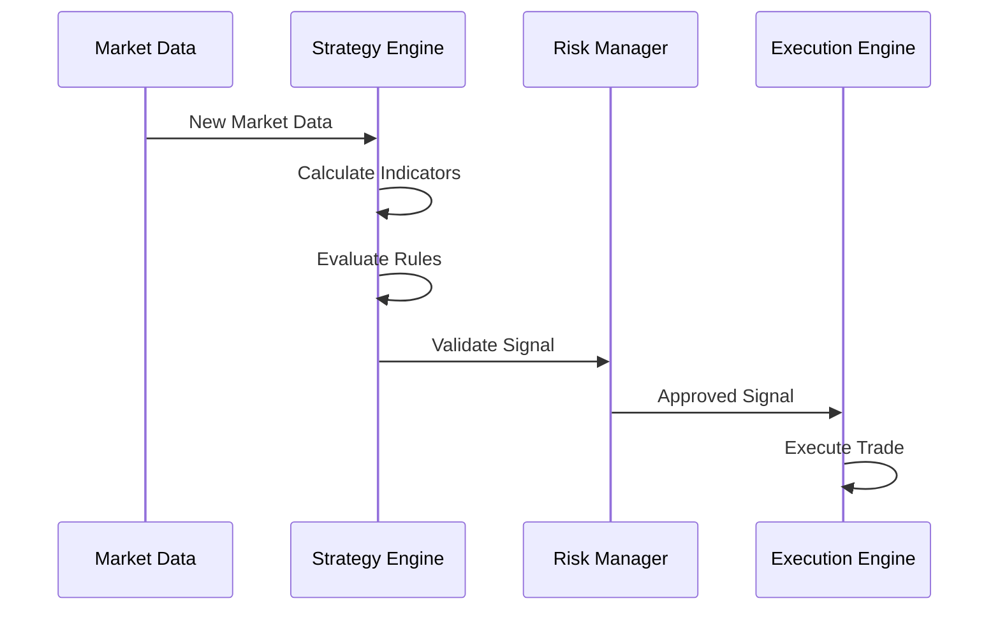

# Epic 2: Strategy Framework Implementation

## Epic Overview
Develop a comprehensive strategy framework that supports the Lingua trading language, strategy validation, backtesting, and real-time execution with proper risk management.

## Business Value
- Enable rapid strategy development and deployment
- Provide comprehensive backtesting and validation tools
- Support multiple strategy types and timeframes
- Ensure proper risk management across all strategies

## Acceptance Criteria
- [ ] Lingua trading language parser and interpreter working
- [ ] Strategy validation and syntax checking implemented
- [ ] Comprehensive backtesting engine operational
- [ ] Real-time strategy execution with risk controls
- [ ] Strategy performance monitoring and reporting

---

## Story 2.1: Lingua Trading Language Parser

**As a** strategy developer  
**I want to** write trading strategies using the Lingua language  
**So that** I can express trading logic in a clear, readable format

### Acceptance Criteria
- [ ] Parse Lingua strategy definitions into executable code
- [ ] Support indicator definitions and calculations
- [ ] Handle trading rules with conditions and actions
- [ ] Validate syntax and provide meaningful error messages
- [ ] Generate optimized execution plans

### Technical Requirements
- Implement Lingua grammar using ANTLR or similar parser generator
- Create Abstract Syntax Tree (AST) representation
- Build symbol table for variables and indicators
- Implement semantic analysis and validation
- Generate executable strategy objects

### Sample Lingua Strategy
```lingua
strategy EMACloudStrategy {
  parameter fastPeriod = 9
  parameter slowPeriod = 20
  parameter riskPercent = 0.02
  
  indicator emaFast = EMA(close, fastPeriod)
  indicator emaSlow = EMA(close, slowPeriod)
  indicator atr = ATR(14)
  
  rule longEntry: emaFast > emaSlow AND emaFast[1] <= emaSlow[1] => 
    buy size calculateSize(riskPercent, atr)
    
  rule longExit: emaFast < emaSlow =>
    sell all
}
```

### Definition of Done
- [ ] Parser successfully handles sample strategies
- [ ] Syntax validation with helpful error messages
- [ ] AST generation and semantic analysis working
- [ ] Unit tests cover all language constructs
- [ ] Documentation with language reference

---

## Story 2.2: Technical Indicator Engine Integration

**As a** strategy developer  
**I want to** use comprehensive technical indicators in my strategies  
**So that** I can implement sophisticated trading logic

### Acceptance Criteria
- [ ] Integrate TA-Lib for 200+ standard indicators
- [ ] Implement custom Lingua indicators (EMA clouds, ATR bands, RSI gradient)
- [ ] Support multi-timeframe indicator calculations
- [ ] Cache indicator results for performance
- [ ] Validate indicator parameters and handle errors

### Technical Requirements
- Integrate TA-Lib client for standard indicators
- Implement custom indicator calculations
- Create indicator caching system with TTL
- Support vectorized calculations for historical data
- Handle missing data and edge cases

### Custom Indicators
```typescript
// EMA Cloud Implementation
interface EMACloudConfig {
  fastPeriod: number;
  slowPeriod: number;
}

class EMACloudIndicator {
  calculate(data: CandleData[], config: EMACloudConfig): IndicatorValue[] {
    const fastEMA = this.calculateEMA(data, config.fastPeriod);
    const slowEMA = this.calculateEMA(data, config.slowPeriod);
    
    return fastEMA.map((fast, i) => ({
      timestamp: data[i].timestamp,
      value: fast.value - slowEMA[i].value // Cloud difference
    }));
  }
}
```

### Definition of Done
- [ ] All required indicators implemented and tested
- [ ] Performance benchmarks meet requirements
- [ ] Caching system reduces calculation overhead
- [ ] Multi-timeframe support validated
- [ ] Integration tests with real market data

---

## Story 2.3: Strategy Backtesting Engine

**As a** strategy developer  
**I want to** backtest my strategies against historical data  
**So that** I can evaluate their performance before deploying them live

### Acceptance Criteria
- [ ] Execute strategies against historical market data
- [ ] Simulate realistic trading conditions with slippage and fees
- [ ] Generate comprehensive performance reports
- [ ] Support parameter optimization and walk-forward analysis
- [ ] Provide statistical significance testing

### Technical Requirements
- Build event-driven backtesting engine
- Implement realistic order execution simulation
- Calculate comprehensive performance metrics
- Support parameter grid search optimization
- Generate performance visualizations

### Performance Metrics
```typescript
interface BacktestResults {
  totalReturn: number;
  annualizedReturn: number;
  sharpeRatio: number;
  maxDrawdown: number;
  winRate: number;
  profitFactor: number;
  trades: TradeResult[];
  equityCurve: number[];
}
```

### Definition of Done
- [ ] Backtesting engine handles complex strategies
- [ ] Performance metrics calculation validated
- [ ] Parameter optimization working efficiently
- [ ] Visualization and reporting complete
- [ ] Integration with existing MCP architecture

---

## Story 2.4: Real-Time Strategy Execution

**As a** trading system  
**I want to** execute strategies in real-time with live market data  
**So that** I can generate trading signals and execute trades automatically

### Acceptance Criteria
- [ ] Execute strategies with real-time market data feeds
- [ ] Generate trading signals based on strategy logic
- [ ] Handle multiple strategies running concurrently
- [ ] Implement proper error handling and recovery
- [ ] Provide real-time monitoring and control

### Technical Requirements
- Integrate with real-time data feeds
- Implement strategy execution scheduler
- Build signal generation and validation system
- Create strategy state management
- Implement monitoring and alerting

### Strategy Execution Flow


### Definition of Done
- [ ] Real-time execution working with test strategies
- [ ] Multiple strategies can run concurrently
- [ ] Error handling prevents system crashes
- [ ] Monitoring dashboard shows strategy status
- [ ] Performance meets latency requirements

---

## Story 2.5: Strategy Risk Management

**As a** risk manager  
**I want to** control the risk exposure of all trading strategies  
**So that** I can prevent excessive losses and maintain portfolio stability

### Acceptance Criteria
- [ ] Implement position sizing based on volatility and risk parameters
- [ ] Monitor portfolio-level risk exposure in real-time
- [ ] Enforce risk limits and circuit breakers
- [ ] Generate risk alerts and reports
- [ ] Support emergency stop functionality

### Technical Requirements
- Build real-time risk monitoring system
- Implement dynamic position sizing algorithms
- Create risk limit enforcement mechanisms
- Design emergency stop procedures
- Build risk reporting dashboard

### Risk Controls
```typescript
interface RiskLimits {
  maxPositionSize: number;      // Maximum position as % of portfolio
  maxPortfolioRisk: number;     // Maximum portfolio VAR
  maxDrawdown: number;          // Maximum drawdown threshold
  maxCorrelation: number;       // Maximum position correlation
  volatilityMultiplier: number; // Position sizing multiplier
}
```

### Definition of Done
- [ ] Risk management system integrated with strategies
- [ ] Position sizing algorithms validated
- [ ] Risk limits enforced across all strategies
- [ ] Emergency stop procedures tested
- [ ] Risk dashboard operational

---

## Story 2.6: Strategy Performance Monitoring

**As a** portfolio manager  
**I want to** monitor the performance of all trading strategies  
**So that** I can make informed decisions about strategy allocation and optimization

### Acceptance Criteria
- [ ] Track real-time P&L for all strategies
- [ ] Calculate performance metrics and attribution
- [ ] Generate automated performance reports
- [ ] Provide strategy comparison and ranking
- [ ] Alert on performance anomalies

### Technical Requirements
- Build real-time performance tracking system
- Implement performance attribution calculations
- Create automated reporting system
- Design strategy comparison tools
- Build alerting and notification system

### Monitoring Dashboard
```typescript
interface StrategyMetrics {
  strategyId: string;
  currentPnL: number;
  dailyPnL: number;
  totalReturn: number;
  sharpeRatio: number;
  maxDrawdown: number;
  activePositions: number;
  signalCount: number;
  lastSignalTime: number;
  status: 'running' | 'paused' | 'error';
}
```

### Definition of Done
- [ ] Performance monitoring working for all strategies
- [ ] Automated reports generated and delivered
- [ ] Strategy comparison tools operational
- [ ] Alerting system configured and tested
- [ ] Dashboard accessible to stakeholders