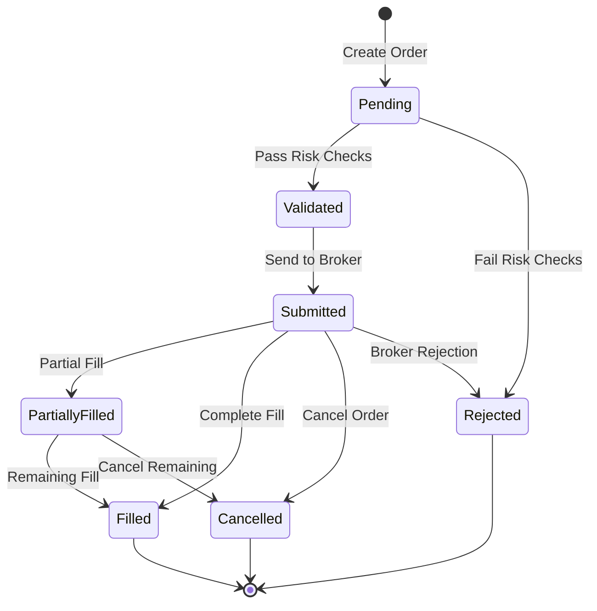
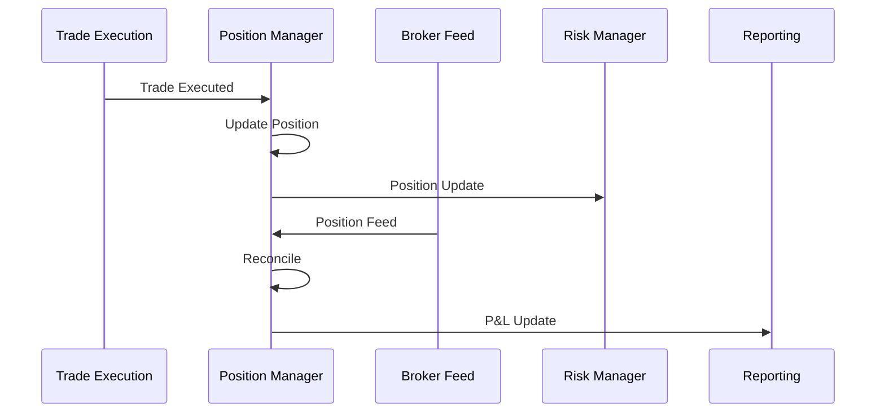

# Epic 3: Execution Engine Implementation

## Epic Overview
Build a robust trade execution engine that handles order management, broker integration, position tracking, and trade reporting with high reliability and low latency.

## Business Value
- Enable automated trade execution with multiple brokers
- Provide reliable order management and tracking
- Support various order types and execution strategies
- Maintain complete audit trail for compliance

## Acceptance Criteria
- [ ] Order execution within 50ms (99th percentile)
- [ ] Support multiple order types and brokers
- [ ] Complete order and trade audit trail
- [ ] Real-time position tracking and reconciliation
- [ ] Integration with risk management system

---

## Story 3.1: Order Management System

**As a** trading system  
**I want to** manage orders through their complete lifecycle  
**So that** I can ensure reliable trade execution and proper tracking

### Acceptance Criteria
- [ ] Create, modify, and cancel orders reliably
- [ ] Track order status through complete lifecycle
- [ ] Handle partial fills and order rejections
- [ ] Maintain order history and audit trail
- [ ] Support multiple order types (market, limit, stop, etc.)

### Technical Requirements
- Design order data model and state machine
- Implement order validation and risk checks
- Build order routing and broker integration
- Create order status tracking and updates
- Implement comprehensive logging and audit trail

### Order State Machine


### Definition of Done
- [ ] Order lifecycle management implemented
- [ ] All order types supported and tested
- [ ] Order validation and risk integration working
- [ ] Audit trail complete and searchable
- [ ] Performance meets latency requirements

---

## Story 3.2: Broker Integration Framework

**As a** trading system  
**I want to** integrate with multiple brokers and execution venues  
**So that** I can route orders optimally and ensure execution redundancy

### Acceptance Criteria
- [ ] Integrate with OsEngine for multi-broker support
- [ ] Implement smart order routing algorithms
- [ ] Handle broker-specific order formats and protocols
- [ ] Monitor broker connectivity and health
- [ ] Support broker failover and load balancing

### Technical Requirements
- Build broker abstraction layer
- Implement OsEngine client integration
- Create order routing decision engine
- Build broker health monitoring
- Implement failover and recovery mechanisms

### Broker Integration Architecture
```typescript
interface BrokerAdapter {
  name: string;
  connect(): Promise<void>;
  disconnect(): Promise<void>;
  submitOrder(order: Order): Promise<OrderResponse>;
  cancelOrder(orderId: string): Promise<boolean>;
  getOrderStatus(orderId: string): Promise<OrderStatus>;
  getPositions(): Promise<Position[]>;
  isHealthy(): Promise<boolean>;
}

class OsEngineBrokerAdapter implements BrokerAdapter {
  // Implementation for OsEngine broker integration
}
```

### Definition of Done
- [ ] OsEngine integration working with multiple brokers
- [ ] Smart order routing algorithms implemented
- [ ] Broker health monitoring operational
- [ ] Failover scenarios tested and validated
- [ ] Performance benchmarks documented

---

## Story 3.3: Position Management System

**As a** trading system  
**I want to** track and manage positions across all strategies and brokers  
**So that** I can maintain accurate portfolio state and risk exposure

### Acceptance Criteria
- [ ] Real-time position tracking across all accounts
- [ ] Position reconciliation with broker feeds
- [ ] Calculate unrealized and realized P&L
- [ ] Handle corporate actions and adjustments
- [ ] Support position netting and gross exposure

### Technical Requirements
- Design position data model and calculations
- Implement real-time position updates
- Build position reconciliation system
- Create P&L calculation engine
- Implement position reporting and analytics

### Position Management Flow


### Definition of Done
- [ ] Position tracking accurate across all accounts
- [ ] Reconciliation working with broker feeds
- [ ] P&L calculations validated and tested
- [ ] Position reporting dashboard operational
- [ ] Integration with risk management complete

---

## Story 3.4: Trade Reporting and Analytics

**As a** compliance officer  
**I want to** access comprehensive trade reports and analytics  
**So that** I can ensure regulatory compliance and analyze trading performance

### Acceptance Criteria
- [ ] Generate comprehensive trade reports
- [ ] Support regulatory reporting requirements
- [ ] Provide trade analytics and performance metrics
- [ ] Export reports in multiple formats
- [ ] Maintain complete audit trail

### Technical Requirements
- Build trade reporting engine
- Implement regulatory report templates
- Create trade analytics calculations
- Build report export functionality
- Implement audit trail search and retrieval

### Reporting Requirements
```typescript
interface TradeReport {
  reportType: 'daily' | 'weekly' | 'monthly' | 'regulatory';
  dateRange: { start: Date; end: Date };
  filters: {
    strategy?: string;
    symbol?: string;
    broker?: string;
    account?: string;
  };
  metrics: {
    totalTrades: number;
    totalVolume: number;
    realizedPnL: number;
    commissions: number;
    averageFillPrice: number;
  };
  trades: TradeDetails[];
}
```

### Definition of Done
- [ ] All required reports implemented and tested
- [ ] Export functionality working for multiple formats
- [ ] Regulatory compliance requirements met
- [ ] Analytics calculations validated
- [ ] Audit trail search operational

---

## Story 3.5: Execution Quality Monitoring

**As a** trader  
**I want to** monitor the quality of trade execution  
**So that** I can optimize order routing and minimize transaction costs

### Acceptance Criteria
- [ ] Measure and report execution latency
- [ ] Calculate slippage and market impact
- [ ] Track fill rates and order rejection rates
- [ ] Compare execution across different brokers
- [ ] Generate execution quality reports

### Technical Requirements
- Build execution metrics collection system
- Implement slippage and impact calculations
- Create broker comparison analytics
- Build execution quality dashboard
- Implement alerting for execution issues

### Execution Quality Metrics
```typescript
interface ExecutionMetrics {
  orderId: string;
  symbol: string;
  orderType: string;
  broker: string;
  submissionTime: Date;
  firstFillTime: Date;
  completionTime: Date;
  latency: number;
  requestedPrice: number;
  averageFillPrice: number;
  slippage: number;
  marketImpact: number;
  fillRate: number;
  commissions: number;
}
```

### Definition of Done
- [ ] Execution metrics collection operational
- [ ] Quality analytics dashboard functional
- [ ] Broker comparison reports available
- [ ] Alerting system configured for quality issues
- [ ] Historical execution analysis tools working

---

## Story 3.6: Emergency Controls and Circuit Breakers

**As a** risk manager  
**I want to** implement emergency controls and circuit breakers  
**So that** I can quickly halt trading in dangerous market conditions

### Acceptance Criteria
- [ ] Implement system-wide trading halt capability
- [ ] Create strategy-specific circuit breakers
- [ ] Monitor market volatility and unusual conditions
- [ ] Provide manual override controls
- [ ] Log all emergency actions for audit

### Technical Requirements
- Build emergency control system
- Implement automated circuit breaker logic
- Create manual control interfaces
- Build market condition monitoring
- Implement comprehensive logging and notifications

### Circuit Breaker Conditions
```typescript
interface CircuitBreakerConfig {
  enabled: boolean;
  conditions: {
    portfolioDrawdown: number;      // Max portfolio drawdown %
    dailyLoss: number;             // Max daily loss amount
    volatilitySpike: number;       // Volatility threshold multiplier
    orderRejectionRate: number;    // Max order rejection rate %
    positionSize: number;          // Max position size
  };
  actions: {
    haltNewOrders: boolean;
    cancelOpenOrders: boolean;
    closeAllPositions: boolean;
    notifyRiskTeam: boolean;
  };
}
```

### Definition of Done
- [ ] Emergency controls working across all systems
- [ ] Circuit breakers tested with simulated conditions
- [ ] Manual override controls operational
- [ ] Notification system working for all stakeholders
- [ ] Emergency procedures documented and validated